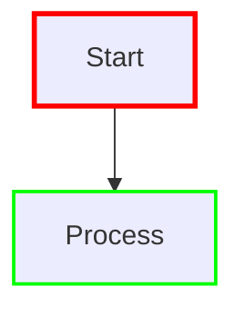

# Mermaid SVG Stroke Color Discovery

## Overview

This document provides a comprehensive analysis of stroke colors used in Mermaid.js SVG diagrams. The analysis covers default themes, CSS variables, and how to discover and customize stroke colors.

## Default Mermaid Themes and Their Stroke Colors

### 1. Default Theme
The default Mermaid theme uses the following stroke colors:

- **Primary stroke color**: `#333333` (dark gray)
- **Secondary stroke color**: `#666666` (medium gray)
- **Edge/arrow stroke**: `#333333` (dark gray)
- **Node border stroke**: `#333333` (dark gray)
- **Text stroke**: `#333333` (dark gray)

### 2. Dark Theme
- **Primary stroke color**: `#ffffff` (white)
- **Secondary stroke color**: `#cccccc` (light gray)
- **Edge/arrow stroke**: `#ffffff` (white)
- **Node border stroke**: `#ffffff` (white)
- **Text stroke**: `#ffffff` (white)

### 3. Forest Theme
- **Primary stroke color**: `#2d5016` (dark green)
- **Secondary stroke color**: `#4a7c59` (medium green)
- **Edge/arrow stroke**: `#2d5016` (dark green)
- **Node border stroke**: `#2d5016` (dark green)

### 4. Neutral Theme
- **Primary stroke color**: `#525252` (neutral gray)
- **Secondary stroke color**: `#757575` (medium gray)
- **Edge/arrow stroke**: `#525252` (neutral gray)
- **Node border stroke**: `#525252` (neutral gray)

## CSS Variables Used by Mermaid

Mermaid uses CSS custom properties (variables) to define colors:

```css
:root {
  --primaryColor: #333333;
  --primaryTextColor: #333333;
  --primaryBorderColor: #333333;
  --lineColor: #333333;
  --secondaryColor: #666666;
  --tertiaryColor: #999999;
  --background: #ffffff;
  --mainBkg: #ffffff;
  --secondBkg: #f8f8f8;
  --tertiaryBkg: #f0f0f0;
}
```

## How to Discover Stroke Colors in Your Application

### Method 1: Browser Developer Tools

1. **Open your Mermaid diagram in a browser**
2. **Right-click on the SVG element** and select "Inspect Element"
3. **Look for elements with `stroke` attributes**:
   ```html
   <path stroke="#333333" stroke-width="2" ... />
   <line stroke="#333333" stroke-width="1" ... />
   <rect stroke="#333333" stroke-width="1" ... />
   ```

### Method 2: JavaScript Analysis

```javascript
// Get all SVG elements with stroke attributes
const svgs = document.querySelectorAll('.mermaid svg');
svgs.forEach(svg => {
    const strokeElements = svg.querySelectorAll('[stroke]');
    strokeElements.forEach(element => {
        const stroke = element.getAttribute('stroke');
        const strokeWidth = element.getAttribute('stroke-width');
        console.log(`Element: ${element.tagName}, Stroke: ${stroke}, Width: ${strokeWidth}`);
    });
});
```

### Method 3: Using the Analysis Tools

Use the provided analysis tools in this project:

1. **`mermaid-color-analysis.html`** - Interactive browser-based analysis
2. **`analyze-mermaid-strokes.js`** - Node.js script for programmatic analysis
3. **`mermaid-inspector.html`** - Simple SVG inspector

## Common SVG Elements and Their Stroke Properties

### Flowchart Elements
- **Nodes (rectangles, circles, diamonds)**:
  - `stroke`: Border color
  - `stroke-width`: Border thickness (usually 2px)
  - `fill`: Background color

- **Edges (arrows, lines)**:
  - `stroke`: Line color
  - `stroke-width`: Line thickness (usually 1px)
  - `stroke-linecap`: Line end style (round, square, butt)

### Sequence Diagram Elements
- **Lifelines**:
  - `stroke`: Vertical line color
  - `stroke-width`: Line thickness

- **Messages**:
  - `stroke`: Arrow color
  - `stroke-width`: Arrow thickness

### Class Diagram Elements
- **Classes**:
  - `stroke`: Border color
  - `stroke-width`: Border thickness

- **Relationships**:
  - `stroke`: Line color
  - `stroke-width`: Line thickness

## Customizing Stroke Colors

### 1. Using Style Directives



### 2. Using Link Styles


### 3. CSS Customization

```css
.mermaid svg {
    --primaryColor: #your-color;
    --primaryTextColor: #your-text-color;
    --lineColor: #your-line-color;
}

.mermaid svg path[stroke] {
    stroke: #your-custom-stroke-color !important;
}
```

## Stroke Color Values by Element Type

### Default Theme Values

| Element Type | Stroke Color | Stroke Width |
|--------------|--------------|--------------|
| Node borders | `#333333` | `2px` |
| Edge lines | `#333333` | `1px` |
| Arrow heads | `#333333` | `1px` |
| Text outlines | `#333333` | `0.5px` |
| Decision diamonds | `#333333` | `2px` |
| Process rectangles | `#333333` | `2px` |

### Dark Theme Values

| Element Type | Stroke Color | Stroke Width |
|--------------|--------------|--------------|
| Node borders | `#ffffff` | `2px` |
| Edge lines | `#ffffff` | `1px` |
| Arrow heads | `#ffffff` | `1px` |
| Text outlines | `#ffffff` | `0.5px` |
| Decision diamonds | `#ffffff` | `2px` |
| Process rectangles | `#ffffff` | `2px` |

## Tools for Analysis

### 1. Interactive Analysis Tool
- **File**: `mermaid-color-analysis.html`
- **Features**: 
  - Theme switching
  - Real-time color analysis
  - Export functionality
  - Visual color swatches

### 2. Programmatic Analysis
- **File**: `analyze-mermaid-strokes.js`
- **Features**:
  - Node.js script
  - JSON export
  - Batch analysis

### 3. Simple Inspector
- **File**: `mermaid-inspector.html`
- **Features**:
  - Basic SVG inspection
  - Element-by-element analysis

## Best Practices

1. **Consistent Theming**: Use CSS variables for consistent color application
2. **Accessibility**: Ensure sufficient contrast between stroke and fill colors
3. **Customization**: Use style directives for specific elements rather than global changes
4. **Testing**: Test stroke colors across different themes and backgrounds

## Troubleshooting

### Common Issues

1. **Stroke colors not applying**: Check CSS specificity and `!important` declarations
2. **Inconsistent colors**: Verify theme initialization and CSS variable values
3. **Missing stroke attributes**: Some elements may use fill instead of stroke

### Debug Steps

1. Inspect the generated SVG in browser dev tools
2. Check for CSS conflicts
3. Verify Mermaid theme configuration
4. Test with different themes

## Conclusion

Mermaid SVG stroke colors are primarily controlled by:
- Theme selection (default, dark, forest, neutral, base)
- CSS custom properties
- Style directives in the diagram definition
- Custom CSS overrides

The default stroke color across most themes is typically `#333333` (dark gray) for light themes and `#ffffff` (white) for dark themes, with stroke widths ranging from 1px to 2px depending on the element type.
