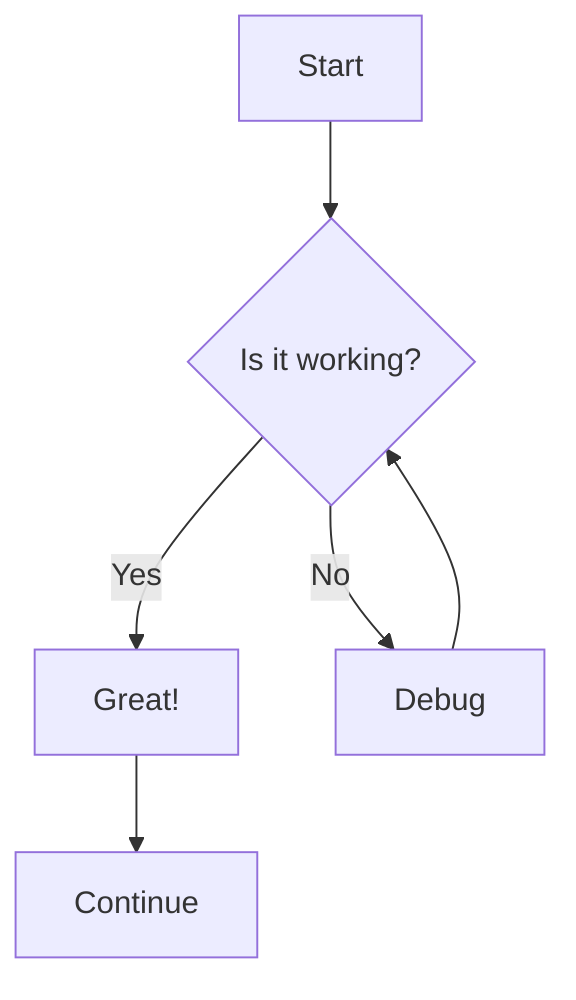

# Markdown Mermaid Viewer

A powerful web application for viewing and editing Markdown files with embedded [Mermaid](https://mermaid.js.org/) diagrams. Built with Next.js and React.

## Features

- **Live Preview**: Write Markdown and see it rendered in real-time
- **Mermaid Support**: Create and view diagrams directly in your Markdown
- **Responsive Design**: Works on desktop and mobile devices
- **GitHub Markdown Style**: Renders with familiar GitHub styling
- **Import/Export**: Load and save your Markdown files

## Getting Started

First, install the dependencies:

```bash
npm install
# or
yarn install
# or
pnpm install
```

Then, run the development server:

```bash
npm run dev
# or
yarn dev
# or
pnpm dev
```

Open [http://localhost:3000](http://localhost:3000) with your browser to see the application.

## How to Use

1. Write or paste your Markdown content in the editor panel
2. View the rendered output in the preview panel
3. Mermaid diagrams will automatically render when enclosed in ````mermaid` code blocks
4. Use the tab switcher to focus on either editing or viewing
5. Import or export your content using the provided buttons

## Example Mermaid Usage

```markdown
# My Document

Here's a flowchart:


```

## Technologies Used

- [Next.js](https://nextjs.org/) - React framework
- [React](https://reactjs.org/) - UI library
- [Mermaid](https://mermaid.js.org/) - Diagramming and charting tool
- [Marked](https://marked.js.org/) - Markdown parser
- [DOMPurify](https://github.com/cure53/DOMPurify) - XSS sanitizer
- [Tailwind CSS](https://tailwindcss.com/) - CSS framework
- [shadcn/ui](https://ui.shadcn.com/) - UI component library

## License

This project is open-source and available under the MIT License.
