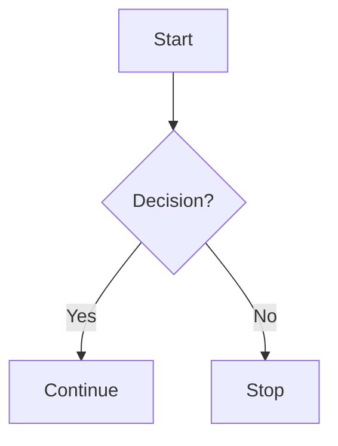

# Markdown

A modern Next.js application for viewing and editing Markdown content with Mermaid diagram support, optimized for Bun.

## Features

- **Markdown Editor**: Rich text editing with syntax highlighting
- **Mermaid Diagrams**: Support for various diagram types (flowcharts, sequence diagrams, class diagrams, etc.)
- **Real-time Preview**: Split-view editing with live preview
- **Responsive Design**: Mobile-friendly interface
- **Theme Support**: Light/dark mode toggle
- **File Import/Export**: Save and load your Markdown files

## Tech Stack

- **Framework**: Next.js 15 with App Router
- **Language**: TypeScript
- **Runtime**: Bun (optimized)
- **Styling**: Tailwind CSS
- **UI Components**: Radix UI + shadcn/ui
- **Markdown**: Marked.js with custom Mermaid processing
- **Diagrams**: Mermaid.js

## Quick Start

### Prerequisites

1. **Install Bun**: Make sure you have Bun installed
   ```bash
   curl -fsSL https://bun.sh/install | bash
   ```

2. **Verify Installation**:
   ```bash
   bun --version
   ```

### Development

1. **Install Dependencies**:
   ```bash
   bun install
   ```

2. **Start Development Server**:
   ```bash
   bun run dev
   ```

3. **Open Browser**: Navigate to [http://localhost:3000](http://localhost:3000)

### Production Build

1. **Build the Application**:
   ```bash
   bun run build
   ```

2. **Start Production Server**:
   ```bash
   bun run start
   ```

## Available Scripts

- `bun run dev` - Start development server with Turbopack
- `bun run build` - Build for production
- `bun run start` - Start production server
- `bun run lint` - Run ESLint
- `bun run type-check` - Run TypeScript type checking
- `bun run clean` - Clean build artifacts
- `bun run install-deps` - Install dependencies using Bun

## Project Structure

```
src/
├── app/                 # Next.js App Router pages
├── components/          # React components
│   ├── ui/             # shadcn/ui components
│   ├── doc-viewer.tsx  # Document viewer component
│   ├── docs-sidebar.tsx # Documentation sidebar
│   ├── markdown-editor.tsx # Markdown editor
│   └── markdown-viewer.tsx # Markdown renderer with Mermaid
├── hooks/               # Custom React hooks
├── lib/                 # Utility functions
└── actions/             # Server actions
```

## Mermaid Diagram Support

The application supports various Mermaid diagram types:

- **Flowcharts**: `graph TD`, `flowchart LR`
- **Sequence Diagrams**: `sequenceDiagram`
- **Class Diagrams**: `classDiagram`
- **Gantt Charts**: `gantt`
- **And more...**

### Example

```markdown


## Configuration Files

- `bunfig.toml` - Bun configuration
- `.bunrc` - Additional Bun runtime settings
- `next.config.ts` - Next.js configuration
- `tsconfig.json` - TypeScript configuration

## Benefits of Using Bun

- **Faster Package Installation**: Significantly faster than npm/yarn
- **Improved Build Performance**: Better TypeScript compilation
- **Memory Efficiency**: Lower memory usage during development
- **Native TypeScript Support**: Built-in TypeScript support
- **Full Compatibility**: Works with existing Node.js ecosystem

## Contributing

1. Fork the repository
2. Create a feature branch
3. Make your changes
4. Run tests and type checking
5. Submit a pull request

## License

This project is open source and available under the [MIT License](LICENSE).
